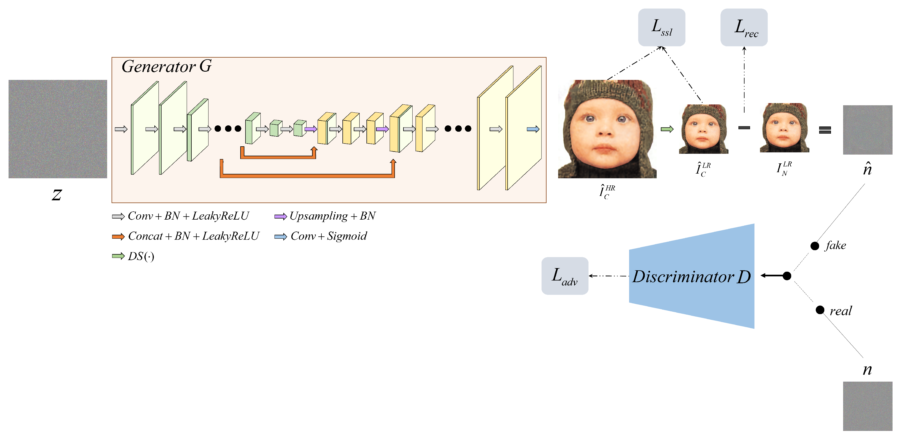
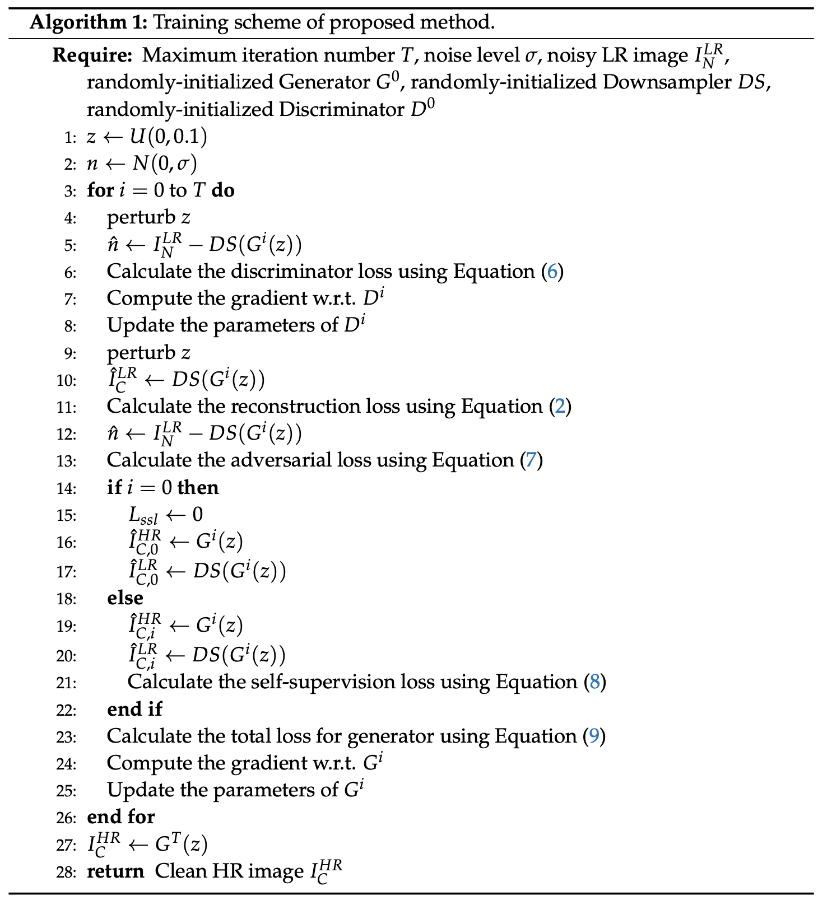
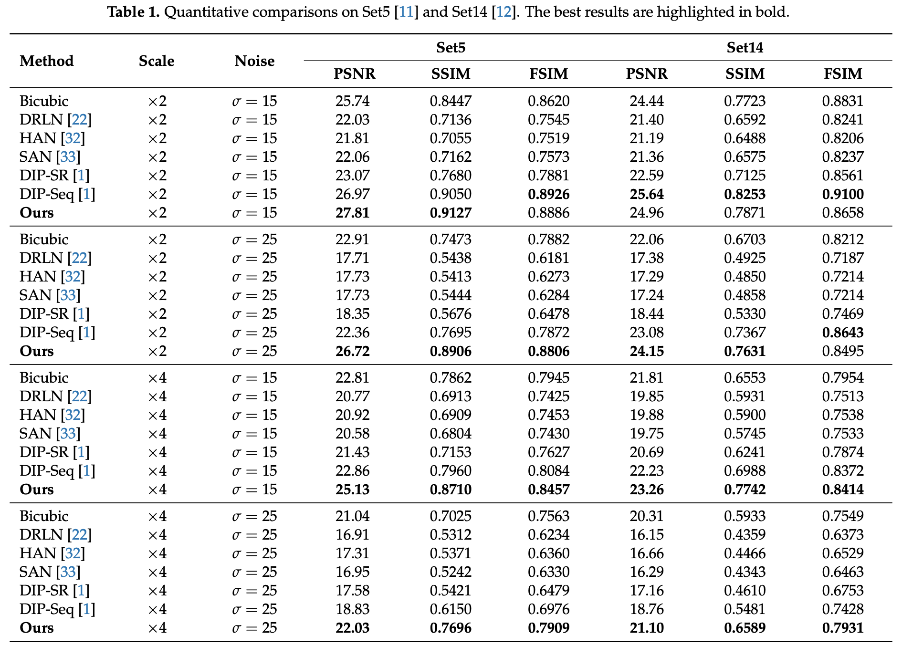

# Deep Image Prior for Super Resolution of Noisy Images

This repository is the official implementation of [Deep Image Prior for Super Resolution of Noisy Images](https://doi.org/10.3390/electronics10162014). 



## Overview



## Requirements

To install requirements:

- python >= 3.6
- pytorch >= 1.2.0
- numpy
- imageio

## Training

Run this command:

```train
python train.py
```

Check training settings via [configs.py](https://github.com/sujyQ/DIPforSRofNoisyImages/blob/42b1d4d6d9ab4cfd651cc9cf2620ddb0dc5ada7b/configs.py)


## Compared data
Compared images are in `/data/`.
~~~
data
  - set5                        : Set5 dataset
    - clean                     : original images
      - baby.png
      - bird.png
      ...
    - x2_15                     : halved-size + noise(level=15)
      - baby_HR_gt.png          : ground-truth image
      - baby_bicubic.png        : upsampled via bicubic
      - baby_clean.png          : ground-truth noise image
      - baby_clean_shifted.png  : shifted ground-truth noise to get zero mean
      ...
    - x2_25   : halved-size + noise(level=25)
    - x4_15   : quatered-size + noise(level=15)
    - x4_25   : quatered-size + noise(level=25)
    
  - set14     : Set14 dataset
    - clean   : original images
    - x2_15   : halved-size + noise(level=15)
    - x2_25   : halved-size + noise(level=25)
    - x4_15   : quatered-size + noise(level=15)
    - x4_25   : quatered-size + noise(level=25)
~~~
## Quantitative Results

### PSNR | SSIM


## Qualitative Results

### X2, sig=15


### X2, sig=25


### X4, sig=15


### X4, sig=25


## Contribution

This code is built on [DIP](https://github.com/DmitryUlyanov/deep-image-prior). We thank the authors for sharing the code.

## Citation

>@article{han2021deep,  
>  title={Deep Image Prior for Super Resolution of Noisy Image},  
>  author={Han, Sujy and Lee, Tae Bok and Heo, Yong Seok},  
>  journal={Electronics},  
>  volume={10},  
>  number={16},  
>  pages={2014},  
>  year={2021},  
>  publisher={Multidisciplinary Digital Publishing Institute}  
>}
